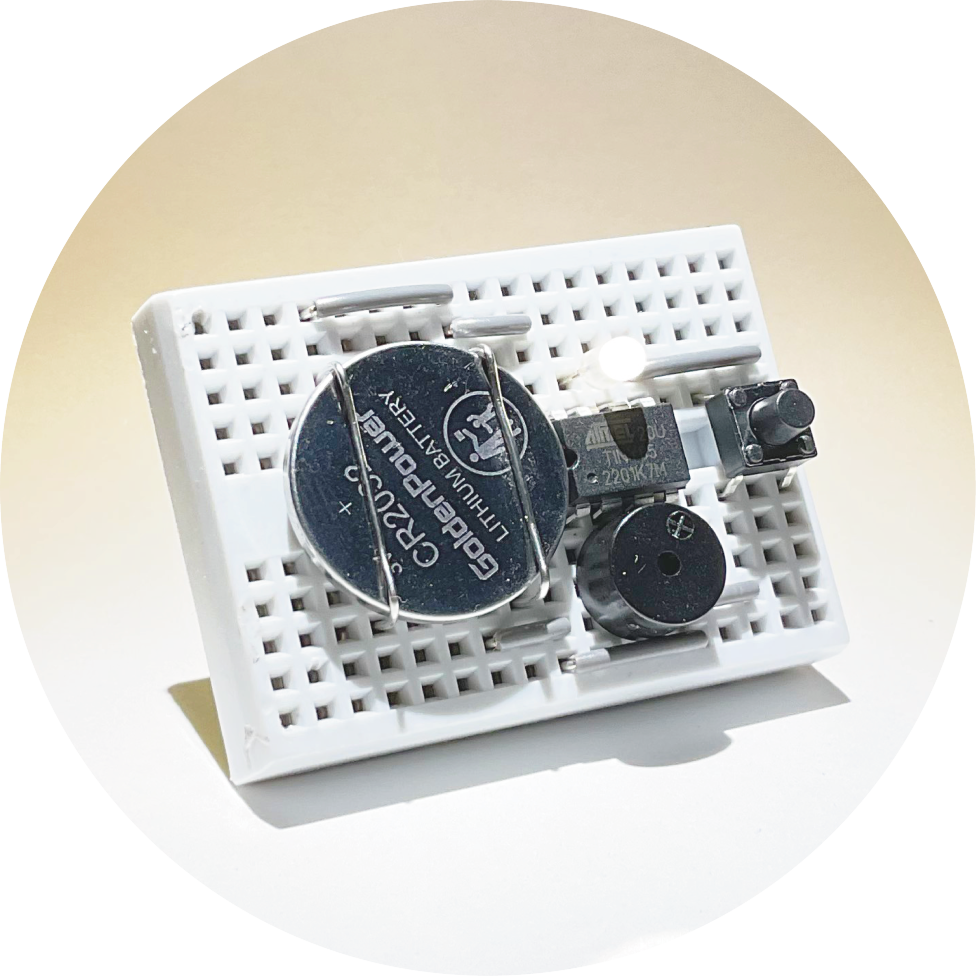
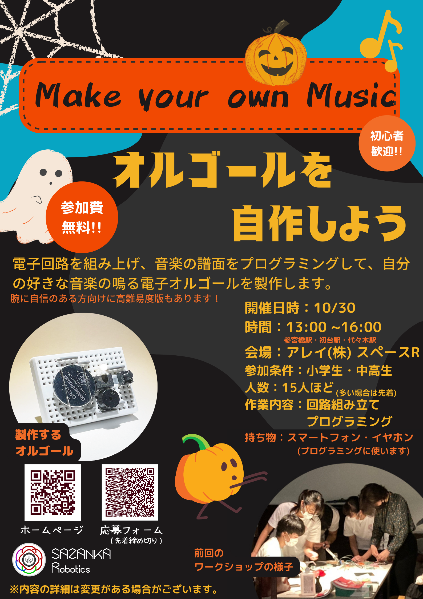

# 電子オルゴールを作ろう！ 
**イベント終了しました。**
<h2>>> <a href="https://781sazanka.github.io/blog/reader.html?href=20221031.md">開催の様子はこちら </a> <<</h2>

>

**10/30(日)** に小学生・中高生向けの電子オルゴール製作ワークショップを開催します!  
  
こんにちは。SAZANKA Roboticsです。私たちは国際ロボコンへの参加を目指して活動している中高生のロボット団体です。  
また、私たちはロボットを製作している他に、国際大会”FIRST”の精神である「若者たちに科学技術の魅力を伝えること」に基づき、「アウトリーチ活動」というイベントを開催しています。この活動は小中高生に電子工作やロボットに触れて興味を持ってもらうことを目的にしています。  
本イベントではハロウィンにちなんで、ハロウィンっぽい(?)曲を流せる電子オルゴールを自作します。  
電子オルゴールに音楽の楽譜コードを書き込んで、お好みの音楽を再生できます。（音楽/コードのサンプルは何種類かこちらで用意してあります）  
  
## イベント内容  
- 団体の紹介  
- 電子オルゴール製作  
	- ブレッドボードを利用した回路組み立て  
	- スマートフォンで音符のコードを書き込むプログラミング  
（プログラミングコードを書き込むものと音符を文字で書き込めるもの(初めての方向け)を用意してあるので、レベルに合わせてお選びいただけます）  
（腕に自信のある方向けに高難易度版もあります！ぜひ挑戦してみてください）  
## イベント詳細  
| | |
|:--|:--|
|開催日時|10/30|  
|時間|13:00 ~16:00|  
|会場|アレイ(株) 地下一階  東京都渋谷区代々木３丁目４２−１０ アレイ（株）|  
|参加条件|小学生・中高生|  
|人数|15人ほど|  
|持ち物|スマートフォン・イヤホン (プログラミングに使います)|  

★参加無料です。材料はこちらで用意いたします。  
★自分で製作したオルゴールはお持ち帰りいただけます。  
★製作難易度の変更、メンバーのサポートが用意されておりますので、小学生の方から高校生までレベルに合わせてお楽しみいただけます。
---
## 申し込みはこちら→→→ https://docs.google.com/forms/d/e/1FAIpQLSffuFTBa44avFiRUAVcVR85P6Xi3NM8HrHRXYLm1tPykHvlQg/viewform?vc=0&c=0&w=1&flr=0
---

SAZANKA Roboticsのメンバーの高校生やメンターさんと一緒にワークショップに楽しめます。  
電子工作、STEAMに気軽に触れることができます。  
プログラミング、組み立て、 ロボットなどに興味がある方は是非来てください！  
まだ電子工作などに触れたことがない人に向けにイベントを開催しています。初心者の方も大歓迎ですので、ぜひお気軽にお越しください。メンバーが丁寧にサポートします。もちろん、経験者の方のご参加もお待ちしております。上級者向けのガイドも用意しておりますので、ぜひご参加ください！  
皆さんのご参加お待ちしております！  
何かご不明の点がありましたらSAZANKA Roboticsの公式InstagramのDM, メールまたは応募フォームでお問い合わせください！
  
  
  

